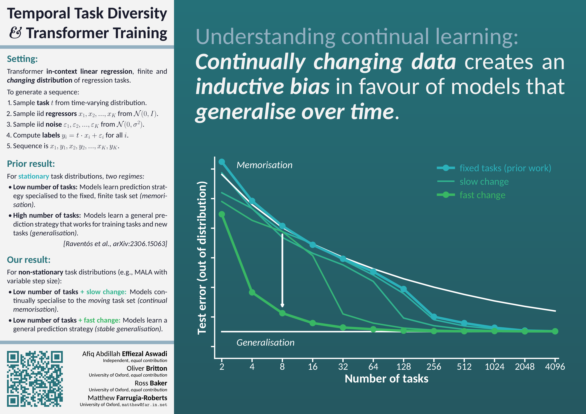

<h1 align="center">Temporal Task Diversity: Inductive Biases Under Non-Stationarity in Synthetic Sequence Modelling</h1>

<p align="center">
  Afiq Abdillah Effiezal Aswadi<sup>=</sup>
  · Oliver Britton<sup>=</sup>
  · Ross Baker<sup>=</sup>
  · Matthew Farrugia-Roberts
</p>

<p align="center">
  <a href="https://tais2026.cc/proceedings/farrugiaroberts-temporal-diversity">Paper</a> presented at <a href="https://tais2026.cc/">TAIS 2026</a>
</p>

> **Abstract:** Modern deep learning science often assumes that neural networks
> learn from a fixed data distribution. However, many practically important
> learning problems involve data distributions that change throughout training.
> How does such *non-stationarity* impact the inductive biases of deep learning
> towards models with different structural, generalisation, and safety
> properties? A fruitful testbed for studying inductive bias is in-context
> linear regression sequence modelling, where small transformers display
> strikingly different generalisation patterns depending on the diversity of
> the (fixed) training task distribution. In this paper, we explore the effect
> of diversifying the task distribution *across training time,* finding that
> such temporal diversity leads to an increased bias towards generalisation
> over memorisation.

<br/>

<div align="center">
  
  
</div>

<br/>

Recommended citation:

```
@inproceedings{EffiezalAswadi+2026,
  title={Temporal Task Diversity: Inductive Biases Under Non-Stationarity in
    Synthetic Sequence Modelling},
  author={Effiezal Aswadi, Afiq Abdillah
    and Britton, Oliver
    and Baker, Ross
    and Farrugia-Roberts, Matthew
  },
  booktitle={Technical AI Safety Conference (TAIS)},
  year={2026},
}
```

## Overview

This repository contains code used to replicate the main experiments in the
paper. Namely, training transformers on synthetic in-context linear regression
(ICLR) sequences, following the setting of [Raventós et al.
(2023)](https://arxiv.org/abs/2306.15063). Each transformer is trained on
sequences of $K$ input-output pairs ($\mathbf x_k, y_k)$, where $\mathbf x_k$
is sampled from a standard multivariate Gaussian $\mathcal N(\mathbf 0_D,
\mathbf I_D)$ and $y_k = \mathbf t^\top x_k + \varepsilon$ for a shared latent
regression vector $\mathbf t$ (the *task*), and $\varepsilon \sim \mathcal N(0,
\sigma^2)$ is noise. The transformer learns to predict $y_k$ from the preceding
pairs.

Each $\mathbf t$ either comes from a task set $\mathcal T_M = \{\mathbf t_1,
\ldots, \mathbf t_M\}$ for some collection of tasks $\mathbf t_k \sim \mathcal
N(\mathbf 0, \mathbf I_D)$, which induces a discrete uniform distribution over
$M$ task vectors (the *task diversity*) $\mathbf t \sim \text{Unif}(\mathbf
t_1, \ldots, \mathbf t_M)$, or $\mathbf t \sim \mathcal N(\mathbf 0, \mathbf
I_D)$, equivalent to an infinite set of Gaussian tasks. In our work, we look at
the impact of non-stationarity in the task set $\mathcal T_M$. Throughout
training, we either adjust each task via a MALA random walk, or resample tasks
at random intervals according to a Dirichlet distribution.

In this repository, we are interested in determining the following properties
of transformers trained in this setting:

- **How close the transformer's predictions are to two natural Bayesian
  baselines:** *The discrete minimum mean squared error* (dMMSE) predictor is
  the posterior mean under a uniform prior over $\mathcal T_M$. The *ridge*
  predictor is the posterior mean under $\mathcal N(\mathbf 0, \mathbf I_D)$ as
  the prior over the tasks. We measure how close the transformer is to each via
  $\Delta_\text{PT, dMMSE}$ and $\Delta_\text{PT, Ridge}$, the mean squared
  distance between the transformer's predictions and these optimal predictors
  on held-out sequences.
- **What is the transformer's implicit prior over task vectors:** The
  transformer has an implicit prior over the latent $\mathbf t$ it is
  inferring. We approximate this via *predictive Monte Carlo*, where by rolling
  out unconditionally from the model and fitting OLS to each generated sequence
  we may find an approximate sample of $\mathbf t$ from the transformer's
  prior. The energy distance between this empirical distribution and the dMMSE
  / ridge priors tells us how close the transformer is to each of the Bayesian
  baselines.

The two main entry points are:

- [`experiment_iclr_task_diversity.py`](./experiment_iclr_task_diversity.py):
  trains a single transformer, and records the per-training-step metrics (loss,
  $\Delta_\text{PT, dMMSE}$, $\Delta_\text{PT, Ridge}$) to a JSON file in
  `runs/`. With `--compute-energy-distance`, it additionally records the energy
  distance between the transformer's implicit prior and the dMMSE / ridge
  priors at each evaluation step. Non-stationarity is controlled by either
  `--mala-step-size` (for the MALA random walk) or `--num-resamples` (for the
  number of resampling events as determined by a Dirichlet distribution).
- [`experiment_iclr_prior_tracking.py`](./experiment_iclr_prior_tracking.py):
  trains a single transformer, and samples the transformer's implicit prior at
  regular intervals and writes these to a `snapshots.npz` file, alongside
  per-snapshot $\Delta_\text{PT}$ metrics. This is used to inspect the prior
  distribution over training time. Non-stationarity is controlled by either
  `--mala-step-size` or `--num-resamples` (in this script using equispaced
  resampling).

Note: Here "iclr" stands for "in-context linear regression", not the deep
learning conference.

## Installation

Requires Python 3.12 or later. We recommend using
[uv](https://github.com/astral-sh/uv).

```sh
git clone https://github.com/matomatical/temporal-task-diversity.git
cd temporal-task-diversity
uv sync                     
uv sync --group tpu # On TPU hosts, additionally install the JAX TPU backend
```

## Usage

### Train a transformer

Use [`experiment_iclr_task_diversity.py`](./experiment_iclr_task_diversity.py)
to train a transformer. By default this script uses the hyperparameters
detailed in Appendix A of the paper (see [Hyperparameters](#hyperparameters)),
and with this configuration each training step takes about 5ms on a dual-core
TPU v4, so the default 524288-step run takes about 45 minutes.

Each run writes metrics to `runs/iclr_task_diversity/<run_name>.json` and saves
an orbax checkpoint to `runs/iclr_task_diversity/checkpoints/<run_name>/`. By
default, re-running with the same `--run-name` resumes from the latest
checkpoint, but this may be overriden by `--force-restart`.

```sh
# Train a transformer on a fixed set of 32 tasks, and record metrics to runs/iclr_task_diversity/first-run.json
uv run experiment_iclr_task_diversity.py --task-diversity 32 --run-name first-run

# Train a transformer and additionally record the energy distance between the
# implicit prior and the Bayesian reference priors every 800 steps. Predictive
# Monte Carlo requires a head that emits a likelihood (override the default
# `point` with `gaussian` or `mog`); each rollout runs for --num-examples steps.
uv run experiment_iclr_task_diversity.py \
    --task-diversity 32 \
    --num-examples 64 \
    --head-type gaussian \
    --compute-energy-distance \
    --run-name first-stationary-energy-distance-run

# Train a transformer on a non-stationary set of tasks, updating according to a
# MALA random walk with step size 1e-3
uv run experiment_iclr_task_diversity.py \
    --task-diversity 32 \
    --mala-step-size 1e-3 \
    --run-name mala-td64-1e-3

# Train a transformer on a non-stationary set of tasks where each task is
# resampled at 10 randomly chosen points throughout training
uv run experiment_iclr_task_diversity.py \
    --task-diversity 32 \
    --num-resamples 10 \
    --run-name resampling-td64-R10
```

The main finding of the paper is that non-stationarity lowers the task
diversity threshold for which the transformer switches from memorisation-like
behaviour (approximating dMMSE) to generalisation (approximating ridge).
For a minimal replication, try the following four configurations:

```sh
# M=8, stationary: converges to dMMSE.
uv run experiment_iclr_task_diversity.py --task-diversity 8 --run-name td8-stationary

# M=64, stationary: converges to ridge.
uv run experiment_iclr_task_diversity.py --task-diversity 64 --run-name td64-stationary

# M=8, small amount of non-stationarity: still converges to dMMSE.
uv run experiment_iclr_task_diversity.py --task-diversity 8 --mala-step-size 1e-3 --run-name td8-mala-1e-3

# M=8, large amount of non-stationarity: now converges to ridge instead, despite task diversity being 8.
uv run experiment_iclr_task_diversity.py --task-diversity 8 --mala-step-size 1e-2 --run-name td8-mala-1e-2
```

To verify the result, check the `stats` in the output JSON. `train_delta_dmmse`
should be near zero in the `td8-stationary` and `td8-mala-1e3` runs, and
`train_delta_ridge` near zero in the `td64-stationary` and `td8-mala-1e-2`
runs.

Very large step sizes ($\gamma \ge 10^{-1}$) at low task diversity exhibit
training instability and converge to neither of the reference predictors, see
Appendix C of the paper.

See [Full options](#full-options) for more information.

### Track a transformer's prior throughout training

Use [`experiment_iclr_prior_tracking.py`](./experiment_iclr_prior_tracking.py)
to track a transformer's implicit prior at many points during training. By
default it uses the 1D setting $D = 1, M = 1, K = 64$. Each run writes
`config.json` and `snapshots.npz` to `runs/iclr_prior_tracking/<run_name>/`,
note that there is no checkpointing for this script.

```sh
# Track the prior of a transformer when trained on a stationary set of tasks
uv run experiment_iclr_prior_tracking.py --run-name stationary-tracking

# Track the prior of a transformer when the tasks are changing according to a MALA random walk
uv run experiment_iclr_prior_tracking.py --mala-step-size 1e-2 --run-name mala-1e-2

# Track the prior of a transformer when there are 64 task resamples (equispaced throughout training)
uv run experiment_iclr_prior_tracking.py --num-resamples 64 --run-name resampling-R64

# Track the prior of a transformer, taking denser snapshots in a particular window
uv run experiment_iclr_prior_tracking.py \
    --num-steps 100000 \
    --dense-step-start 40000 \
    --dense-step-end 50000 \
    --dense-snapshot-period 64 \
    --run-name zoom-40k-50k
```

See [Full options](#full-options) for more information.

### Hyperparameters

The architecture, optimiser, and training schedule are fixed across all runs in
the paper and match the defaults of both training scripts. The per-experiment
variables ($M$, $\gamma$, $R$, seed) vary across runs and are set via CLI
flags. The architecture itself lives in [`iclr/setting.py`](iclr/setting.py).

| Category | Hyperparameter | CLI flag | Default |
| --- | --- | --- | --- |
| Data | Task vector dimension ($D$) | `--task-dim` | 8 |
| Data | In-context examples ($K$) | `--num-examples` | 16 or 64 (higher for prior tracking) |
| Data | Observation noise variance ($\sigma^2$) | `--noise-var` | 0.25 |
| Model | Number of layers | `--num-blocks` | 8 |
| Model | Attention heads per layer | `--num-heads` | 2 |
| Model | Embedding dimension | `--embed-size` | 128 |
| Model | MLP hidden dimension | `--mlp-size` | 128 |
| Model | Layer normalisation | — | Pre |
| Model | Positional embeddings | — | Learned |
| Model | Attention mask | — | Causal |
| Model | Prediction head | `--head-type` | `point` / `gaussian` / `mog` |
| Model | Mixture components ($G$) | `--num-components` | 4 (only used when `--head-type=mog`) |
| Optimiser | Type | — | Adam |
| Optimiser | Peak learning rate ($\eta$) | `--learning-rate` | 3e-3 |
| Optimiser | Warm-up | `--lr-warmup` / `--no-lr-warmup` | 10% linear, then constant |
| Training | Batch size ($B$) | `--batch-size` | 256 |
| Training | Total steps ($T$) | `--num-steps` | 524288 ($2^{19}$) |
| Per-experiment | Task diversity ($M$) | `--task-diversity` | varies |
| Per-experiment | MALA step size ($\gamma$) | `--mala-step-size` | varies |
| Per-experiment | Resampling events ($R$) | `--num-resamples` | varies |
| Per-experiment | PRNG seed | `--seed` | varies |

### Output format

#### [`experiment_iclr_task_diversity.py`](./experiment_iclr_task_diversity.py)

For [`experiment_iclr_task_diversity.py`](./experiment_iclr_task_diversity.py),
each run writes

```
runs/iclr_task_diversity/<run_name>.json          # per-step metrics
runs/iclr_task_diversity/checkpoints/<run_name>/  # orbax checkpoint
```

The JSON metrics have the shape:

```jsonc
{
  "times": {
    "start": ...,
    "end": ...
  },
  "config": {...},
  "stats": [
    {
      "step": 0,
      "lr": ...,
      "timestamp": ...,
      "train_error_model": ...,                // train_* keys: evaluated on sequences derived from training step task set
      "train_error_ridge": ...,
      "train_error_dmmse": ...,
      "test_error_model": ...,                 // test_* keys: evaluated on sequences derived from tasks sampled from N(0, I_D)
      "test_error_ridge": ...,
      "test_error_dmmse": ...,
      "train_delta_dmmse": ...,
      "train_delta_ridge": ...,
      "test_delta_dmmse": ...,
      "test_delta_ridge": ...,
      "train_nll_model": ...,                  // only with --head-type gaussian or mog
      "test_nll_model": ...,                   // only with --head-type gaussian or mog
      "train_delta_tail_dmmse": ...,           // only with --delta-tail-start
      "train_delta_tail_ridge": ...,           // only with --delta-tail-start
      "test_delta_tail_dmmse": ...,            // only with --delta-tail-start
      "test_delta_tail_ridge": ...,            // only with --delta-tail-start
      "energy_dist/prior/dmmse": ...,          // only with --compute-energy-distance
      "energy_dist/prior/ridge": ...           // only with --compute-energy-distance
    },
    ...
  ]
}
```

#### [`experiment_iclr_prior_tracking.py`](./experiment_iclr_prior_tracking.py)

For [`experiment_iclr_prior_tracking.py`](./experiment_iclr_prior_tracking.py),
each run writes

```
runs/iclr_prior_tracking/<run_name>/config.json
runs/iclr_prior_tracking/<run_name>/snapshots.npz
```

where `snapshots.npz` contains in compressed numpy format the arrays

```
steps           int32    [N]
losses          float32  [N]
tasks           float32  [N, M, D]
pr              float32  [N, num_pr_samples, D]
delta_dmmse     float32  [N]
delta_ridge     float32  [N]
resample_steps  int32    [#events]                # only when --num-resamples > 0
config          str      scalar (JSON)
```

## Full options

### `experiment_iclr_task_diversity.py`

```
$ uv run experiment_iclr_task_diversity.py --help

usage: experiment_iclr_task_diversity.py [-h] [OPTIONS]

Train an in-context regression transformer at one configuration. Stationary by
default. Set --mala-step-size for MALA random-walk non-stationarity, or
--num-resamples for Dirichlet resampling non-stationarity. With
--compute-energy-distance, also records the energy distance between the
transformer's implicit prior (sampled via predictive Monte Carlo) and the dMMSE
/ ridge priors.

Writes per-step metrics to <output_root>/<run_name>.json and an orbax checkpoint
under <output_root>/checkpoints/<run_name>/. Re-invoking with the same
--run-name resumes training from the latest saved checkpoint, pass
--force-restart to discard this checkpoint and start again with the same
run_name.

╭─ options ────────────────────────────────────────────────────────────────────╮
│ -h, --help              show this help message and exit                      │
│ --task-diversity INT    number of latent task vectors (M); task set is       │
│                         sampled from N(0, I_D) at start. (default: 1)        │
│ --mala-step-size FLOAT  MALA random-walk step size (gamma) for               │
│                         non-stationary training; mutually exclusive with     │
│                         --num-resamples. (default: 0.0)                      │
│ --num-resamples INT     number of Dirichlet resampling events (R) per task;  │
│                         mutually exclusive with --mala-step-size. (default:  │
│                         0)                                                   │
│ --seed INT              PRNG seed. (default: 42)                             │
│ --output-root PATH      parent directory under which the run JSON and        │
│                         checkpoints subdirectory are created. (default:      │
│                         runs/iclr_task_diversity)                            │
│ --run-name {None}|STR   name for <output_root>/<run_name>.json and           │
│                         <output_root>/checkpoints/<run_name>/;               │
│                         auto-generated from a timestamp if unset.            │
│                         Re-invoking with the same name resumes training from │
│                         the latest saved checkpoint. (default: None)         │
│ --task-dim INT          task vector dimension (D in the paper). (default: 8) │
│ --num-examples INT      in-context examples per sequence (K). (default: 16)  │
│ --noise-var FLOAT       observation noise variance (sigma^2). (default:      │
│                         0.25)                                                │
│ --head-type {point,gaussian,mog}                                             │
│                         prediction head. "point" predicts a scalar;          │
│                         "gaussian" predicts a mean and variance; "mog"       │
│                         predicts a mixture of Gaussians. (default: point)    │
│ --num-components INT    number of mixture components (G); used only when     │
│                         --head-type=mog. (default: 4)                        │
│ --num-blocks INT        number of transformer layers. (default: 8)           │
│ --num-heads INT         attention heads per layer. (default: 2)              │
│ --embed-size INT        transformer embedding dimension. (default: 128)      │
│ --mlp-size INT          MLP hidden dimension per block. (default: 128)       │
│ --num-steps INT         total training steps. (default: 524288)              │
│ --learning-rate FLOAT   Adam peak learning rate. (default: 0.003)            │
│ --batch-size INT        gradient batch size. (default: 256)                  │
│ --lr-warmup, --no-lr-warmup                                                  │
│                         linearly warm up the LR from 0 over the first 10% of │
│                         training before holding it constant; set             │
│                         --no-lr-warmup for a constant LR throughout.         │
│                         (default: True)                                      │
│ --eval-period INT       interval (in training steps) between evaluation      │
│                         passes. (default: 64)                                │
│ --eval-batch-size INT   batch size for held-out evaluation sequences (drawn  │
│                         from N(0, I_D)). (default: 1024)                     │
│ --delta-prompt-length INT                                                    │
│                         prompt prefix length used for the Delta_PT metric    │
│                         computations. (default: 16)                          │
│ --delta-tail-start {None}|INT                                                │
│                         if set, additionally compute Delta metrics over      │
│                         positions delta_tail_start..K-1. (default: None)     │
│ --checkpoint-period INT                                                      │
│                         interval (in training steps) between orbax           │
│                         checkpoint saves. (default: 8192)                    │
│ --compute-energy-distance, --no-compute-energy-distance                      │
│                         also compute energy distance to the dMMSE and ridge  │
│                         priors at each evaluation step. (default: False)     │
│ --energy-distance-period INT                                                 │
│                         interval (in training steps) between energy-distance │
│                         evaluations. (default: 800)                          │
│ --energy-n-samples INT  predictive Monte Carlo samples per evaluation.       │
│                         (default: 5000)                                      │
│ --final-checkpoint, --no-final-checkpoint                                    │
│                         keep the orbax checkpoint directory after training   │
│                         finishes; set --no-final-checkpoint to delete it and │
│                         retain only the JSON. (default: True)                │
│ --force-restart, --no-force-restart                                          │
│                         remove any existing checkpoint at --run-name before  │
│                         starting and train from scratch; default is to       │
│                         resume. (default: False)                             │
╰──────────────────────────────────────────────────────────────────────────────╯
```

### `experiment_iclr_prior_tracking.py`
```
$ uv run experiment_iclr_prior_tracking.py --help

usage: experiment_iclr_prior_tracking.py [-h] [OPTIONS]

Train a transformer and snapshot its implicit prior over task vectors via
predictive Monte Carlo. Defaults configure the 1D scenario (task_dim=1,
task_diversity=1) where the prior can be visualised as a histogram on the real
line. Stationary by default. Set --mala-step-size for MALA random-walk
non-stationarity, or --num-resamples for equispaced resampling non-stationarity
(this is the equispaced scheme; the Dirichlet partition lives in
experiment_iclr_task_diversity.py). MALA takes precedence when both are set.

Snapshots are taken every --snapshot-period training steps; an optional
dense-snapshot window (--dense-step-start, --dense-step-end,
--dense-snapshot-period) takes higher-resolution snapshots within a
sub-interval.

Writes a snapshots.npz archive of prior samples and per-snapshot Delta_PT,dMMSE
/ Delta_PT,Ridge metrics under <output_root>/<run_name>/, where <run_name>
defaults to a timestamp if not specified. This script does not resume from
previous runs.

╭─ options ────────────────────────────────────────────────────────────────────╮
│ -h, --help              show this help message and exit                      │
│ --task-diversity INT    number of latent task vectors (M); fixed set sampled │
│                         from N(0, I_D) (default: 1)                          │
│ --mala-step-size FLOAT  MALA random-walk step size (gamma) for               │
│                         non-stationary training; takes precedence over       │
│                         --num-resamples if both are set (default: 0.0)       │
│ --num-resamples INT     number of independently-sampled task sets shown over │
│                         R equal-length segments (R-1 internal resampling     │
│                         events); 0 disables resampling (default: 0)          │
│ --seed INT              PRNG seed (default: 0)                               │
│ --output-root PATH      parent directory under which the run subdirectory is │
│                         created (default: runs/iclr_prior_tracking)          │
│ --run-name {None}|STR   name for the run subdirectory under output_root;     │
│                         defaults to a timestamp if unset (default: None)     │
│ --task-dim INT          task vector dimension (D) (default: 1)               │
│ --num-examples INT      in-context examples per sequence (K) (default: 64)   │
│ --noise-var FLOAT       observation noise variance (sigma^2) (default: 0.25) │
│ --head-type {gaussian,mog}                                                   │
│                         prediction head: single Gaussian (mean+variance) or  │
│                         mixture of Gaussians (default: gaussian)             │
│ --num-components INT    number of mixture components (G); used only when     │
│                         --head-type=mog (default: 4)                         │
│ --num-blocks INT        number of transformer layers (default: 8)            │
│ --num-heads INT         attention heads per layer (default: 2)               │
│ --embed-size INT        transformer embedding dimension (default: 128)       │
│ --mlp-size INT          MLP hidden dimension per block (default: 128)        │
│ --num-steps INT         total training steps (default: 524288)               │
│ --learning-rate FLOAT   Adam peak learning rate (default: 0.003)             │
│ --batch-size INT        gradient batch size (default: 256)                   │
│ --snapshot-period INT   interval (in training steps) between uniform         │
│                         snapshots (default: 512)                             │
│ --num-pr-samples INT    predictive Monte Carlo samples per snapshot          │
│                         (default: 200)                                       │
│ --pr-generation-steps INT                                                    │
│                         autoregressive rollout length per PMC sample         │
│                         (default: 16)                                        │
│ --dense-snapshot-period {None}|INT                                           │
│                         interval between dense snapshots within the dense    │
│                         window; if unset, only uniform snapshots are taken   │
│                         (default: None)                                      │
│ --dense-step-start {None}|INT                                                │
│                         start of an explicit dense-snapshot window;          │
│                         overrides the resampling-aligned dense window        │
│                         (default: None)                                      │
│ --dense-step-end {None}|INT                                                  │
│                         end of an explicit dense-snapshot window (default:   │
│                         None)                                                │
│ --dense-snapshot-window INT                                                  │
│                         width of the dense window placed around each         │
│                         resampling event (used when dense_step_start/end are │
│                         unset) (default: 2048)                               │
│ --force-restart, --no-force-restart                                          │
│                         remove any existing snapshots.npz at --run-name      │
│                         before starting; default is to refuse to overwrite   │
│                         (default: False)                                     │
╰──────────────────────────────────────────────────────────────────────────────╯
```
